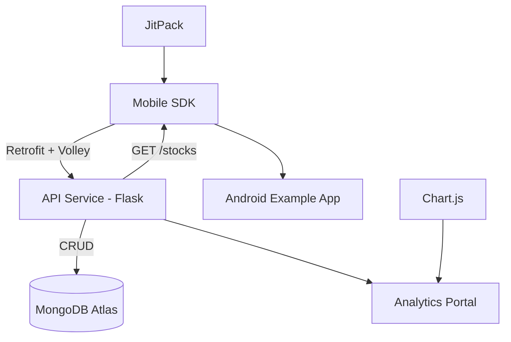

# 📈 StockMarketAPI SDK

**Live API**: [Render Deployment](https://stockmarketapi-qr65.onrender.com)  
**MongoDB Atlas**: Connected via `MONGO_URI`  
**Admin Dashboard**: Web portal for analytics & insights

## Overview

**StockMarketAPI** is a comprehensive mobile-first stock market SDK designed to simplify financial data integration into Android applications. The project includes:

* A RESTful backend service using Flask
* A public Android SDK (Java/Kotlin-compatible)
* A full-featured sample Android app
* A web-based admin analytics portal

---

## 🚀 Features

* 📊 Real-time stock data and global indices
* 📈 Interactive stock graph rendering and performance tracking
* 🔍 Advanced search and filtering capabilities
* 📱 SDK analytics tracking (screen views, time, clicks)
* ⚖️ Multi-stock comparison functionality
* 🌐 Global market indices display
* 📋 Admin dashboard with interactive charts

---

## 🏗️ Architecture



---

## 📦 Installation

### Add JitPack Repository

```groovy
repositories {
    google()
    mavenCentral()
    maven { url = uri("https://jitpack.io") }
}
```

### Add SDK Dependency

```groovy
dependencies {
    implementation("com.github.Ofir-Evgi:StockMarketAPI:1.0.0")
    
    // Required dependencies
    implementation("com.github.PhilJay:MPAndroidChart:v3.1.0")
    implementation("com.squareup.retrofit2:retrofit:2.11.0")
    implementation("com.squareup.retrofit2:converter-gson:2.11.0")
    implementation("com.android.volley:volley:1.2.1")
}
```

---

## 📱 SDK Views Explained

### 🏷️ `StockListView`

**Purpose**: Displays a scrollable, filterable list of stocks with real-time data and analytics tracking.

**Key Features:**
- Uses `RecyclerView` with custom `StockListAdapter`
- Displays stock cards with company name, symbol, current price, and mini-chart
- Real-time price updates with color-coded indicators (green/red)
- Built-in loading states and empty state handling
- Automatic analytics tracking for stock interactions

**Usage:**
```java
StockListView stockListView = findViewById(R.id.stockListView);

// Set stocks data
stockListView.setStocks(stocksList);

// Handle stock clicks
stockListView.setOnStockClickListener(new StockListAdapter.OnStockClickListener() {
    @Override
    public void onStockClick(Stock stock) {
        // Navigate to detailed view or perform action
        Intent intent = new Intent(this, StockDetailActivity.class);
        intent.putExtra("stock", stock);
        startActivity(intent);
    }
});

// Filter stocks by search query
stockListView.filterByText("AAPL");
```

**How It Works:**
- Automatically finds the current price based on market time
- Displays percentage change with appropriate color coding
- Shows mini-charts for quick visual trend analysis
- Tracks user interactions via `AnalyticsTracker.logStockView()`

**Layout Integration:**
```xml
<com.example.stockmarketsdk.views.StockListView
    android:id="@+id/stockListView"
    android:layout_width="match_parent"
    android:layout_height="0dp"
    android:layout_weight="1" />
```

---

### 🔍 `StockSearchView`

**Purpose**: Provides intelligent stock search with autocomplete functionality and real-time filtering.

**Key Features:**
- `AutoCompleteTextView` with smart suggestions
- Real-time search as user types
- Displays both company name and stock symbol
- Integrates seamlessly with `StockListView` for filtering
- Analytics tracking for search behavior

**Usage:**
```java
StockSearchView stockSearchView = findViewById(R.id.stockSearchView);

// Set the stock list for search
stockSearchView.setStockList(allStocks);

// Handle stock selection and search
stockSearchView.setOnStockSelectedListener(new StockSearchView.OnStockSelectedListener() {
    @Override
    public void onStockSelected(Stock stock) {
        // User selected a stock from dropdown
        handleStockSelection(stock);
        
        // Analytics tracking automatically handled
    }

    @Override
    public void onQueryTyped(String rawText) {
        // Real-time filtering as user types
        stockListView.filterByText(rawText);
    }
});
```

**How It Works:**
- Maintains internal list of all available stocks
- Filters suggestions based on both company name and symbol
- Displays formatted suggestions: "Apple Inc. (AAPL)"
- Automatically tracks search interactions
- Updates connected `StockListView` in real-time

**Search Algorithm:**
- Case-insensitive matching
- Searches both company name and symbol
- Prioritizes exact symbol matches
- Limits suggestions to prevent UI overflow

**Layout Integration:**
```xml
<com.example.stockmarketsdk.views.StockSearchView
    android:id="@+id/stockSearchView"
    android:layout_width="match_parent"
    android:layout_height="wrap_content"
    android:layout_margin="16dp" />
```

---

### 📈 `StockGraphView`

**Purpose**: Renders interactive, professional-grade stock price charts with MPAndroidChart integration.

**Key Features:**
- Supports both intraday and historical data visualization
- Interactive touch controls (zoom, pan, drag)
- Time-based filtering (market hours: 7:00 AM onwards)
- Cubic bezier curve smoothing for professional appearance
- Automatic axis formatting and labeling
- Multiple data source support

**Usage:**
```java
StockGraphView graphView = findViewById(R.id.graphView);

// Method 1: Display intraday stock data
Stock stock = getSelectedStock();
graphView.setStock(stock); // Shows filtered intraday prices

// Method 2: Load historical data by symbol
graphView.loadHistoryBySymbol("AAPL", "1y"); // 1 year of data

// Method 3: Set historical data directly
List<StockHistory> historyData = getHistoryData();
graphView.setHistoryData(historyData);
```

**Advanced Configuration:**
```java
// The view automatically handles:
// - Market hours filtering (7:00 AM to current time)
// - Data point interval optimization (every 5 minutes for smooth display)
// - Color-coded trend indicators
// - Professional chart styling with proper margins and labels
```

**How It Works:**
- **Time Filtering**: Automatically filters prices to show only market hours
- **Data Optimization**: Intelligently samples data points to prevent overcrowding
- **Interactive Features**: Built-in zoom, pan, and drag capabilities
- **Professional Styling**: Uses corporate-grade chart styling with proper colors and fonts
- **Multiple Data Sources**: Can handle both real-time intraday data and long-term historical data

**Chart Features:**
- X-axis: Time-based with smart label rotation
- Y-axis: Price-based with automatic scaling
- Line Style: Cubic bezier curves for smooth appearance
- Colors: Professional blue theme with proper contrast
- Touch: Enabled for user interaction

**Layout Integration:**
```xml
<com.example.stockmarketsdk.views.StockGraphView
    android:id="@+id/graphView"
    android:layout_width="match_parent"
    android:layout_height="0dp"
    android:layout_weight="1" />
```

---

### 🌍 `GlobalIndexView`

**Purpose**: Displays major global market indices with real-time data and color-coded performance indicators.

**Key Features:**
- Shows major indices: S&P 500, NASDAQ, Dow Jones, DAX, FTSE 100
- Real-time price updates with percentage change
- Color-coded performance (green for gains, red for losses)
- Automatic time-based data filtering
- Clean, readable display format

**Usage:**
```java
GlobalIndexView indexView = findViewById(R.id.globalIndexView);

// Load and display global indices
indexView.loadData(); // Automatically fetches and displays all indices
```

**How It Works:**
- **Data Source**: Pulls from `/global-indices` API endpoint
- **Time Matching**: Finds appropriate price for current market time
- **Display Format**: "Index Name: $4150.50 (+0.5%)"
- **Color Coding**: Automatically applies green/red colors based on performance
- **Fallback Logic**: Shows most recent data if current time data unavailable

**Supported Indices:**
```java
// Automatically displays with friendly names:
// ^GSPC → "S&P 500"
// ^IXIC → "NASDAQ" 
// ^DJI → "Dow Jones"
// ^GDAXI → "DAX"
// ^FTSE → "FTSE 100"
```

**Display Features:**
- **Typography**: Bold, 16sp text for readability
- **Spacing**: Proper padding between entries
- **Colors**: Dynamic color based on performance
- **Format**: Consistent price and percentage display

**Layout Integration:**
```xml
<com.example.stockmarketsdk.views.GlobalIndexView
    android:id="@+id/globalIndexView"
    android:layout_width="match_parent"
    android:layout_height="wrap_content" />
```

---

### ⚖️ `StockComparisonView`

**Purpose**: Enables side-by-side comparison of multiple stocks with individual performance cards.

**Key Features:**
- Displays multiple `StockCardView` entries
- Shows individual stock performance with mini-charts
- Calculates and displays percentage changes
- Clean, organized comparison layout
- Supports unlimited number of stocks

**Usage:**
```java
StockComparisonView comparisonView = findViewById(R.id.comparisonView);

// Add stocks for comparison
ArrayList<Stock> selectedStocks = getSelectedStocks();
for (Stock stock : selectedStocks) {
    comparisonView.addStock(stock);
}

// Clear comparison when done
comparisonView.clear();
```

**How It Works:**
- **Card Generation**: Creates individual `StockCardView` for each stock
- **Price Calculation**: Determines latest price from price history
- **Performance Display**: Shows current price with trend indicators
- **Layout Management**: Vertical stack of comparison cards
- **Memory Management**: Provides clear() method for cleanup

**Integration with Charts:**
```java
// Often used alongside LineChart for detailed comparison
LineChart comparisonChart = findViewById(R.id.comparisonChart);

// Add each stock to both view and chart
for (Stock stock : stocks) {
    comparisonView.addStock(stock);
    addStockToChart(stock); // Your custom chart logic
}
```

**Layout Integration:**
```xml
<com.example.stockmarketsdk.views.StockComparisonView
    android:id="@+id/comparisonView"
    android:layout_width="match_parent"
    android:layout_height="wrap_content" />
```

---

### 🏷️ `StockCardView`

**Purpose**: Individual stock display component with price information and mini-chart visualization.

**Key Features:**
- Displays company name, symbol, and current price
- Mini-chart showing price trend
- Color-coded price indicators with arrows
- Percentage change calculation and display
- Responsive layout design

**Usage:**
```java
StockCardView cardView = new StockCardView(context);

// Set basic stock information
cardView.setStockData("Apple Inc.", "AAPL", 150.25);

// Add price history for trend display
List<StockPrice> priceHistory = stock.getPrices();
cardView.setHistory(priceHistory);

// Add to parent layout
parentLayout.addView(cardView);
```

**How It Works:**
- **Price Display**: Formats price as "$150.25 (±2.5%)"
- **Color Logic**: Green for gains, red for losses, gray for no change
- **Arrow Indicators**: Up/down arrows based on performance
- **Mini-Chart**: Uses `MiniChartView` for trend visualization
- **Trend Calculation**: Compares first and last prices in history

**Visual Elements:**
- **Stock Name**: Company name in primary text
- **Symbol**: Stock symbol in secondary text  
- **Price**: Formatted with color and percentage
- **Arrow**: Direction indicator with matching color
- **Chart**: Small trend chart below text

**Automatic Features:**
```java
// Automatically handles:
// - Null data with "N/A" fallback
// - Color coding based on performance
// - Arrow visibility based on change
// - Price formatting with proper decimals
// - Percentage calculation from price history
```

**Layout Integration:**
```xml
<com.example.stockmarketsdk.views.StockCardView
    android:id="@+id/stockCard"
    android:layout_width="match_parent"
    android:layout_height="wrap_content"
    android:layout_margin="8dp" />
```

---

### 📊 `MiniChartView`

**Purpose**: Compact chart component for displaying stock price trends within cards and lists.

**Key Features:**
- Lightweight chart implementation using MPAndroidChart
- Optimized for small display areas
- Automatic data point sampling for performance
- Clean, minimal design without axes or labels
- Smooth cubic bezier curve rendering

**Usage:**
```java
MiniChartView miniChart = findViewById(R.id.miniChart);

// Set price history for trend display
List<StockPrice> priceHistory = stock.getPrices();
miniChart.setHistoryData(priceHistory);
```

**How It Works:**
- **Data Sampling**: Limits to 20 points maximum for performance
- **Curve Smoothing**: Uses cubic bezier interpolation
- **Minimal UI**: No axes, labels, or interactive elements
- **Color Theme**: Professional blue theme (#1E88E5)
- **Performance**: Optimized for embedding in lists and cards

**Configuration:**
```java
// Automatically configured with:
// - Transparent background
// - Disabled touch interaction
// - No axes or legends
// - 2px line width
// - Proper margins and padding
```

**Visual Design:**
- **Background**: Transparent for seamless integration
- **Line**: 2px width, professional blue color
- **Style**: Smooth curves without data points
- **Size**: Adapts to container with proper aspect ratio

---

## 💡 Complete Implementation Example

### MainActivity Setup
```java
public class MainActivity extends AppCompatActivity {
    private StockSearchView stockSearchView;
    private StockListView stockListView;
    private ArrayList<Stock> selectedStocks = new ArrayList<>();
    private long startTimeMillis;

    @Override
    protected void onCreate(Bundle savedInstanceState) {
        super.onCreate(savedInstanceState);
        setContentView(R.layout.activity_main);

        startTimeMillis = System.currentTimeMillis();
        
        // Initialize views
        stockSearchView = findViewById(R.id.stockSearchView);
        stockListView = findViewById(R.id.stockListView);

        // Load stock data
        loadStockData();
        
        // Setup interactions
        setupStockInteractions();
        
        // Analytics tracking
        String userId = getPackageName();
        AnalyticsTracker.logScreenView(this, "main_screen", userId);
    }

    private void loadStockData() {
        StockService.getStocks(new OnStocksLoadedListener() {
            @Override
            public void onSuccess(List<Stock> stocks) {
                stockListView.setStocks(stocks);
                stockSearchView.setStockList(stocks);
            }

            @Override
            public void onError(String errorMessage) {
                Toast.makeText(MainActivity.this, 
                    "Error: " + errorMessage, Toast.LENGTH_SHORT).show();
            }
        });
    }

    private void setupStockInteractions() {
        // Search functionality
        stockSearchView.setOnStockSelectedListener(new StockSearchView.OnStockSelectedListener() {
            @Override
            public void onStockSelected(Stock stock) {
                handleStockSelection(stock);
            }

            @Override
            public void onQueryTyped(String rawText) {
                stockListView.filterByText(rawText);
            }
        });

        // List item clicks
        stockListView.setOnStockClickListener(this::handleStockSelection);
    }

    private void handleStockSelection(Stock stock) {
        selectedStocks.add(stock);
        Toast.makeText(this, "Selected: " + stock.getSymbol(), Toast.LENGTH_SHORT).show();
        
        // Analytics tracking automatically handled by views
        String userId = getPackageName();
        AnalyticsTracker.logStockView(this, stock.getSymbol(), userId);
    }
    
    @Override
    protected void onDestroy() {
        super.onDestroy();
        long durationSeconds = (System.currentTimeMillis() - startTimeMillis) / 1000;
        String userId = getPackageName();
        AnalyticsTracker.logScreenTime(this, "main_screen", durationSeconds, userId);
    }
}
```

### Stock Graph Activity
```java
public class StockGraphActivity extends AppCompatActivity {
    private static final String START_TIME = "07:00";
    private Stock stock;
    private long startTimeMillis;

    @Override
    protected void onCreate(Bundle savedInstanceState) {
        super.onCreate(savedInstanceState);
        setContentView(R.layout.activity_stock_graph);

        startTimeMillis = System.currentTimeMillis();
        stock = (Stock) getIntent().getSerializableExtra("stock");
        
        StockGraphView graphView = findViewById(R.id.graphView);
        TextView stockNameText = findViewById(R.id.stockNameText);

        if (stock != null) {
            String userId = getPackageName();
            AnalyticsTracker.logScreenView(this, "stock_graph", userId);
            AnalyticsTracker.logStockView(this, stock.getSymbol(), userId);

            // Filter prices for market hours (7:00 AM to current time)
            String currentTime = new SimpleDateFormat("HH:mm", Locale.getDefault()).format(new Date());
            List<StockPrice> filtered = new ArrayList<>();
            
            for (StockPrice price : stock.getPrices()) {
                String time = price.getTime();
                if (time.compareTo(START_TIME) >= 0 && time.compareTo(currentTime) <= 0) {
                    filtered.add(price);
                } else if (time.compareTo(currentTime) > 0) {
                    break;
                }
            }

            stockNameText.setText(stock.getCompany_name() + " (" + stock.getSymbol() + ")");
            stock.setPrices(filtered);
            graphView.setStock(stock);
        }
    }
}
```

---

## 🌐 Backend API Endpoints

| Endpoint                  | Method | Description                  | Response                    |
| ------------------------- | ------ | ---------------------------- | --------------------------- |
| `/stocks`                 | GET    | Get all stock data           | `List<Stock>`               |
| `/stocks/<symbol>`        | GET    | Get single stock by symbol   | `Stock`                     |
| `/stocks`                 | POST   | Add new stock                | `{"message": "success"}`    |
| `/stocks/<symbol>`        | PUT    | Update existing stock        | `{"message": "updated"}`    |
| `/stocks/<symbol>`        | DELETE | Delete stock                 | `{"message": "deleted"}`    |
| `/global-indices`         | GET    | Get global market indices    | `List<GlobalIndexData>`     |
| `/analytics/events`       | POST   | Log screen/stock interaction | `{"message": "logged"}`     |
| `/analytics/stock-clicks` | GET    | Top clicked stocks           | `List<{symbol, clicks}>`    |
| `/analytics/screen-views` | GET    | Most viewed screens          | `List<{screen, views}>`     |
| `/analytics/top-duration` | GET    | Screens by avg time spent    | `List<{screen, avg_time}>`  |

### API Usage Examples

**Get All Stocks:**
```java
StockService.getStocks(new OnStocksLoadedListener() {
    @Override
    public void onSuccess(List<Stock> stocks) {
        // Handle success
    }

    @Override
    public void onError(String errorMessage) {
        // Handle error
    }
});
```

**Load Stock History:**
```java
StockMarketApi.getStockHistory("AAPL", "1y").enqueue(new Callback<BaseResponse<List<StockHistory>>>() {
    @Override
    public void onResponse(Call<BaseResponse<List<StockHistory>>> call, Response<BaseResponse<List<StockHistory>>> response) {
        if (response.isSuccessful() && response.body() != null) {
            List<StockHistory> history = response.body().getData();
            graphView.setHistoryData(history);
        }
    }

    @Override
    public void onFailure(Call<BaseResponse<List<StockHistory>>> call, Throwable t) {
        // Handle failure
    }
});
```

---

## 📊 Analytics Integration

The SDK automatically tracks user interactions for comprehensive analytics:

```java
// Automatically logged by views:
AnalyticsTracker.logStockView(context, stockSymbol, userId);
AnalyticsTracker.logScreenView(context, screenName, userId);
AnalyticsTracker.logScreenTime(context, screenName, duration, userId);
```

**Tracked Events:**
- **Stock Views**: When users select or view stock details
- **Screen Navigation**: Time spent on each screen
- **Search Queries**: User search behavior and patterns
- **User Interactions**: Clicks, taps, and navigation flows

**Analytics Data Structure:**
```json
{
  "event": "stock_view",
  "symbol": "AAPL",
  "user_id": "com.example.app",
  "timestamp": "2025-01-20T10:30:00Z"
}
```

---

## 🎨 Admin Portal

Web dashboard for insights visualization built with HTML + Chart.js:

**Features:**
* 📊 **Top Clicked Stocks**: Bar chart showing most popular stocks
* 📱 **Screen Analytics**: Most viewed screens and time spent  
* ⏱️ **Session Analytics**: Average time per screen
* 📈 **Real-time Charts**: Interactive visualizations with Chart.js

**Access:** [Admin Portal](https://stockmarketapi-qr65.onrender.com/admin)

**Portal Structure:**
```
admin/
├── index.html          # Main dashboard
├── style.css          # Responsive styling
└── script.js          # Chart.js integration
```

**Dashboard Screenshots:**
- Top stock interactions with color-coded bars
- Screen engagement metrics
- Time-based analytics with trend indicators

---

## 🏛️ Project Architecture

### Backend (Flask + MongoDB)
```
backend/
├── app.py                 # Main Flask application
├── requirements.txt       # Python dependencies
├── render.yaml           # Deployment configuration
└── upload_to_mongo.py        # Database seeding script
```

### Android SDK
```
stockmarketsdk/
├── models/               # Data models (Stock, StockPrice, etc.)
├── services/            # API services and analytics
├── views/               # Custom UI components
├── ApiClient.java       # Retrofit configuration
└── StockMarketApi.java  # Main API interface
└── StockApiService.java  # Main API interface
```

### Sample Application
```
app/
├── MainActivity.java         # Main screen with search & list
├── StockGraphActivity.java   # Individual stock charts
├── StockComparisonActivity.java  # Multi-stock comparison
└── GlobalIndicesActivity.java    # Market indices display
├── StockDetailActivity.java
├── StockAdapter.java   

```

---

## 🔧 Configuration & Setup

### Prerequisites
- **Minimum SDK**: 26 (Android 8.0)
- **Target SDK**: 35 (Android 15)
- **Java Version**: 11
- **Internet Permission**: Required for API access

### Permissions
Add to your `AndroidManifest.xml`:
```xml
<uses-permission android:name="android.permission.INTERNET" />
<uses-permission android:name="android.permission.ACCESS_NETWORK_STATE" />
```

### ProGuard Rules
If using code obfuscation, add these rules:
```
-keep class com.example.stockmarketsdk.models.** { *; }
-keep class com.example.stockmarketsdk.services.** { *; }
-keepclassmembers class * {
    @com.google.gson.annotations.SerializedName <fields>;
}
```

---

## 🎯 Usage Best Practices

### Memory Management
```java
// Clear comparison view when done
comparisonView.clear();

// Properly handle lifecycle in activities
@Override
protected void onDestroy() {
    super.onDestroy();
    // Log analytics before destroying
    AnalyticsTracker.logScreenTime(this, screenName, duration, userId);
}
```

### Error Handling
```java
StockService.getStocks(new OnStocksLoadedListener() {
    @Override
    public void onSuccess(List<Stock> stocks) {
        if (stocks != null && !stocks.isEmpty()) {
            stockListView.setStocks(stocks);
        } else {
            showEmptyState();
        }
    }

    @Override
    public void onError(String errorMessage) {
        Log.e("StockApp", "Error loading stocks: " + errorMessage);
        showErrorDialog(errorMessage);
    }
});
```

### Performance Optimization
```java
// Use filtering for large datasets
stockListView.filterByText(query);

// Implement proper list scrolling
recyclerView.setHasFixedSize(true);
recyclerView.setItemViewCacheSize(20);
```

---

## 🔍 Troubleshooting

### Common Issues

**1. Network Errors**
- Ensure internet permission is added
- Check if the API endpoint is accessible
- Verify network connectivity

**2. Chart Not Displaying**
- Confirm MPAndroidChart dependency is added
- Check if stock data contains price history
- Verify chart view dimensions in layout

**3. Search Not Working**
- Ensure stock list is set before searching
- Check if AutoCompleteTextView threshold is appropriate
- Verify search adapter is properly configured

**4. Analytics Not Tracking**
- Confirm Volley dependency is included
- Check if network requests are allowed
- Verify userId is not null or empty

### Debug Mode
Enable debugging by adding logs:
```java
private static final String TAG = "StockMarketSDK";
Log.d(TAG, "Stock data loaded: " + stocks.size() + " items");
```

---

## 🚀 Deployment

### JitPack Publication
The SDK is automatically published to JitPack when you create a new release:

1. Create a git tag: `git tag 1.0.0`
2. Push tag: `git push origin 1.0.0`
3. JitPack will automatically build and publish

### Backend Deployment (Render)
The Flask API is deployed on Render with the following configuration:
```yaml
services:
  - type: web
    name: stock-api
    env: python
    plan: free
    buildCommand: pip install -r requirements.txt
    startCommand: gunicorn app:app
    envVars:
      - key: MONGO_URI
        value: mongodb+srv://...
```

---

## 📄 License

[MIT License](LICENSE)

Permission is hereby granted, free of charge, to any person obtaining a copy of this software and associated documentation files (the "Software"), to deal in the Software without restriction, including without limitation the rights to use, copy, modify, merge, publish, distribute, sublicense, and/or sell copies of the Software.

---

## 📚 Documentation

* **The full documentation** is available at: [https://ofir-evgi.github.io/StockMarketAPI/](https://ofir-evgi.github.io/StockMarketAPI/)
* **GitHub Pages**: [📄 Complete Documentation](https://ofir-evgi.github.io/StockMarketAPI)
* **API Reference**: Interactive API documentation with examples
* **Video Tutorials**: Step-by-step integration guides

---

## 👨‍💻 Authors

**Ofir Evgi**

**Omer Shukroon**

Advanced Mobile Seminar @ Afeka Academic College Of Engineering 2025  

📧 Contact: [evgiofir1@gmail.com](mailto:evgiofir1@gmail.com)  
🔗 GitHub: [Ofir-Evgi](https://github.com/Ofir-Evgi)

---

## 🤝 Contributing

We welcome contributions! Please follow these steps:

1. Fork the repository
2. Create a feature branch: `git checkout -b feature/new-feature`
3. Commit changes: `git commit -am 'Add new feature'`
4. Push to branch: `git push origin feature/new-feature`
5. Submit a Pull Request

### Development Setup
```bash
# Clone the repository
git clone https://github.com/Ofir-Evgi/StockMarketAPI.git

# Open in Android Studio
# Build and run the sample app
# Make your changes and test thoroughly
```

---

**⭐ If this SDK helps you build amazing financial apps, please give us a star on GitHub!**
